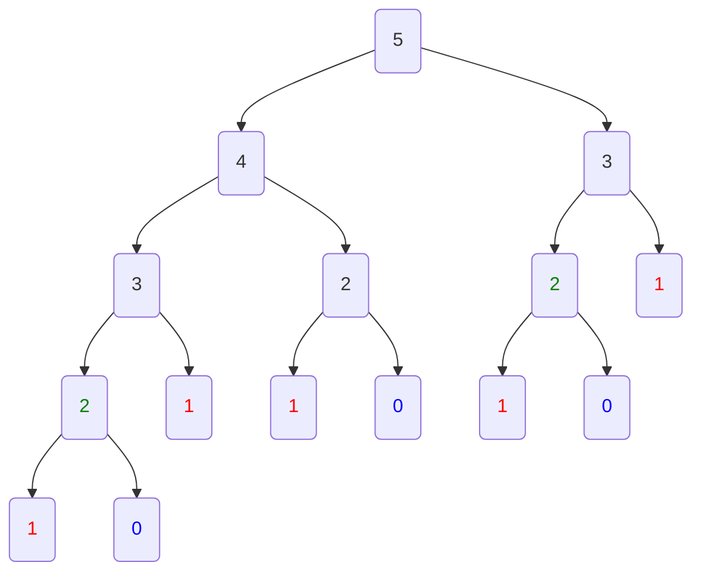

# Memoiozation

Ensures that a method does not run for the same inputs more than once by keeping a record of the results for the given input

It is an optimization technique that speeds up the program by storing the results of function calls and returning the cached results when the same inputs occur again. (Ex: Using a `HashMap`)

### Fibonacci Example

*Fibonacci* is an example where the same inputs occur again where they have the same results. In the following example, the same function is constantly called with an input that was previously also called. The constant recalls make the program slow.




One way in which this program can be optimized is by using a `HashMap` which stores the result based on input

#### Fibonacci without Optimization

```java
public int fib(int n) {
    return n == 0 || n == 1 ? n : fib(n-1) + fib(n-2);
}
```

#### Fibonacci with Optimization

```java
HashMap<Integer, Integer> fbs = new HashMap<>();
public int fib2(int m) {
    if(m ==0 || m == 1) {
        return m;
    } else if(fbs.containsKey(m)) {
        return fbs.get(m);
    } else {
        int fb = fib2(m-1) + fib(m-2);
        fbs.put(fb);
        return fb;
    }   
}
```

