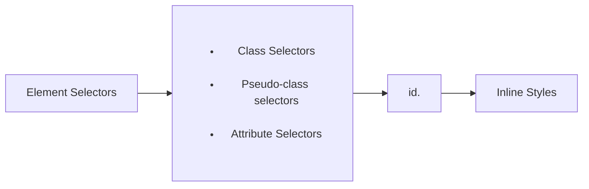

# CSS General

## Specificity Hierarchy

CSS specificity can be calculated using a 4 slot system `0 0 0 0` going from most to least specific and where each number represents the number of targets.



### Slot 1

The least important specificity and is composed of element selectors

```css
p  /* 0 0 0 1 */
span /* 0 0 0 1 */ 
p span /* 0 0 0 2 */
p > span /* 0 0 0 3 */
div p  > span /* 0 0 0 3 */
```

### Slot 2

The second most important specificity and is incremented by:

* Class Selectors
* Pseudo-class selectors
* Attribute Selectors

```css
.name /* 0 0 1 0 */
.users .name  /* 0 0 2 0 */
[href$='.pdf']  /* 0 0 1 0 */
:hover /* 0 0 1 0 */
div .name  /* 0 0 1 1 */
a[href$='.pdf']  /* 0 0 1 1 */
.pictures img:hover  /* 0 0 2 1 */
```

### Slot 3

Slot 3 holds the id selector to target specific elements

```css
#name /* 0 1 0 0 */
.user #name /* 0 1 1 0 */
#name span /* 0 1 0 1 */
```

### Slot 4

Involves inline styles, which will take precedence over any rule defined in a CSS file or inside the `style` tag in the page header

```html
<p style="color: red"> Test </p> <!-- 1 0 0 0 -->
```

## Lengths

### Absolute Lengths

#### Pixels

Pixels are an absolute unit of measurement. A pixel is equal to 1/96th of an inch, and therefore an inch is equal to 96 pixel. Pixels can be used with a handful of different properties, including font size. 

However, due to the variance screen sizes, pixels have become less popular because they do not offer much flexibility as absolute units of measurement.

### Relative Lengths

Relative lengths are more complicated because they are not fixed units of measurement but rely on the length of another element.

#### Percentages

Percentages are defined in relation to the length of another object. 

Setting the width of an element inside the body will set the size in relation to the screen size. 

Setting the width of an element inside another element will set the width in relation to the outer element.

#### em

The `em` notation's length is based on an element's font size.

**Example:** If an element has a font size of 14 pixels, then a width of `5em` would be equal to 70 pixels

When a font size is not state for an element, the `em` unit will be relative to the font size of the closest parent element with a stated font size.

##### Usage

The `em` is often used for styling text, including font sizes, as well as spacing around text, including margins and paddings.


